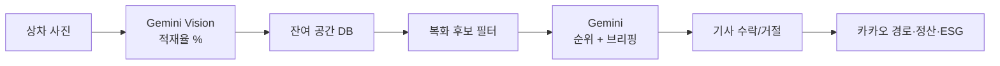

# moveAI — AI 기능 정리 (PPT용)

> **기준 시점**: 2026-08 MVP 시연 구성  
> **주 모델**: Google Vertex AI **Gemini 2.5 Flash**  
> **적재율 엔진**: `SPACE_OCCUPANCY_ENGINE=gemini` (성공 시 Depth/YOLO 생략)  
> **시연 차량 기준**: 11톤 윙바디 · 적재함 2.35×9.30×2.45 m · **30.545 CBM** · 최대적재 **11,000 kg**

---

## 1. 한눈에 보기 (슬라이드용 표)

| 적용한 AI 기능 | 사용한 모델 / 도구 | AI가 수행하는 역할 | 결과물에서 제공하는 가치 |
|---|---|---|---|
| **상차 사진 → 적재율·잔여공간 실측** | **Gemini 2.5 Flash Vision** (Vertex AI)<br>폴백: Depth Anything + YOLOv8n-Seg + OpenCV | 후방 적재함 사진을 보고 점유율(0~100%)·잔여%·잔여 m³ 산출 | 기사가 눈으로 가늠하던 여유공간을 **숫자로 즉시 확인**, 복화 제안·과적재 판단의 기준값 확보 |
| **복화 배차 브리핑 문장 생성** | **Gemini 2.5 Flash** (텍스트) | 이익·우회거리·추가시간·ESG를 기사 친화적 2~3문장으로 요약 | 숫자만 나열하지 않고 **수락/거절 의사결정**을 빠르게 도움 |
| **복화 후보 순위 최적화** | **Gemini 2.5 Flash** + Spring 휴리스틱 점수 | 잔여공간·순이익·추가거리/시간을 고려해 후보 복화 순위화 | “어떤 물량을 먼저 제안할지”를 **자동 선별**, 공차·우회 최소화 |
| **바닥 화물 더미 → 체적·차종별 점유율** (관리자) | OpenCV / YOLO 보조 + 체적 기하 계산 | 화물 사진·치수로 m³ 추정, 3/5/11/18톤 등 fill% 계산 | 운송장·화물 등록 시 **차량 적합도**를 바로 표시 |
| **클라우드 Vision 정밀 파이프라인** (관리자/확장) | Depth Anything V2 Metric + OWL-ViT (Vertex) | 깊이·객체 박스로 여유 CBM·품질점수 산출 | 시연 MVP 보조·고도화 경로 (정밀 기하 매칭) |
| **화물–트럭 매칭** (관리자/확장) | 규칙·기하 알고리즘 (+ 카카오 경로) | 잔여 체적·중량·경로 회랑 기준으로 적재 가능 화물 선정 | 사진 실측 결과를 **실제 배차 후보**로 연결 |

---

## 2. 주요 AI 기능 및 활용 방식

### 2-1. 상차 이미지 적재율 인식 (핵심 시연)

**활용 방식**
1. 기사가 상차 후 **후방에서 적재함 사진** 촬영(또는 파일 업로드)
2. Spring → FastAPI(`/ai/analyze-image`) 호출
3. **Gemini Vision**이 내부 부피 대비 화물 점유율(`occupied_percent`) 추정  
   - 기준: 11톤 · 30.545 CBM
4. 결과를 DB·앱에 반영 → **잔여 % / 잔여 m³ / 과적재 가이드** 표시
5. 이후 복화 제안은 “남은 공간에 들어가는 물량만” 필터

**현재 정책**
- **주경로 = Gemini** (Depth·YOLO는 Gemini 실패 시에만 폴백)
- 시연 안정성·정확도 우선 (테스트 MAE: Gemini 경로가 Depth/YOLO 단독보다 우수)

```
[기사 앱] 사진 업로드
    → [Spring] /api/... 측정 API
    → [FastAPI] Gemini 2.5 Flash Vision
    → occupied% / remaining% / remaining_m³
    → [앱] 적재 격자·잔여공간·복화 가능 여부
```

---

### 2-2. 복화 제안 브리핑

**활용 방식**
- 시스템이 계산한 **순이익·추가 km·추가 분·ESG kg**를 Gemini에 전달
- 기사용 **짧은 한국어 제안 문구** 생성
- 실패 시 템플릿 문장으로 폴백

**예시 역할**  
“경유 시 ○○분이 늘지만 순이익 ○만원, ESG ○kg 절감 — 수락하시겠습니까?”

---

### 2-3. 최적 복화 순위 (Optimal Dispatch)

**활용 방식**
1. Spring이 후보 복화(OD 그룹)와 휴리스틱 점수를 수집
2. Gemini가 **순이익↑ · 우회↓ · 추가시간↓ · 잔여공간 초과 금지** 기준으로 최대 5건 순위화
3. 기사에게 보여줄 briefing 2문장 동시 생성
4. Gemini 장애 시 휴리스틱 순위만 사용

---

### 2-4. (보조) 관리자·클라우드 파이프라인

| 구분 | 내용 |
|---|---|
| Vision Processor | Depth Anything V2 + OWL-ViT로 여유 CBM·품질 점수 |
| Matching Processor | 잔여 체적·중량·경로 회랑으로 화물 매칭 |
| 시연 MVP와의 관계 | **기사 앱 실측의 주엔진은 Gemini**. 클라우드는 확장·정밀 검증용 |

---

## 3. 슬라이드별 상세 (복붙용)

### 슬라이드 A — 적용한 AI 기능

1. **비전 기반 적재율 실측** (상차 사진 → occupied / remaining)
2. **자연어 복화 브리핑** (의사결정 문장)
3. **복화 후보 랭킹** (다목적 최적화형 추천)
4. **체적·차종 fill% 산출** (화물 등록·적합 차량 안내)
5. *(확장)* 깊이·오픈보캐브 검출 기반 정밀 CBM / 화물 매칭

---

### 슬라이드 B — 사용한 모델 또는 도구

| 계층 | 모델·도구 | 용도 |
|---|---|---|
| **LLM / VLM (현재 주력)** | **Gemini 2.5 Flash** (Vertex AI, `us-central1`) | 적재율 Vision · 브리핑 · 복화 순위 |
| 비전 폴백 | Depth Anything 계열 + **YOLOv8n-Seg** + OpenCV | Gemini 실패 시 적재율 보조 |
| 3D 패킹 보조 | **py3dbp** | 잔여 공간에 단위 박스 수용 시뮬레이션 |
| 경로·지도 | **카카오 모빌리티** API | 내비·우회거리·ETA (AI 아님, 연동) |
| 규칙·계산 | Spring `CalculationService` 등 | fill%·유류비·ESG·순이익 수치 |
| 클라우드 확장 | Depth Anything V2 Metric, OWL-ViT | 관리자 Vision 정밀 파이프라인 |

---

### 슬라이드 C — AI가 수행하는 역할

| 역할 | 설명 |
|---|---|
| **인식** | 상차 사진에서 “지금 얼마나 찼는지”를 %·m³로 수치화 |
| **해석** | 과적재·여유  sufficiency를 상태/가이드 문구로 전환 |
| **추천** | 남은 공간·경로에 맞는 복화 물량 순위 제시 |
| **설득(커뮤니케이션)** | 복잡한 손익·ESG를 기사가 바로 이해하도록 문장화 |
| **연결** | 실측 잔여공간 ↔ 배차·내비·정산 플로우의 입력값 제공 |

---

### 슬라이드 D — 결과물에서 AI가 주는 가치

| 사용자 | 가치 |
|---|---|
| **택배 기사** | 빈 공간 감이 아니라 **실측 %**로 복화 수락 판단 → 공차 감소·추가 수익 |
| **물류 운영** | 사진 한 장으로 차량 가용 용량 파악 → **복화 매칭 자동화** |
| **화주/플랫폼** | 체적 기반 배차로 **차량 회전율·적재효율** 향상 |
| **ESG** | 공차·우회 감소분을 **CO₂(kg) 절감**으로 가시화 |
| **시연/설득** | 로그·엔진명(`gemini-2.5-flash-vision`)으로 **AI가 실제로 계산함**을 증명 |

---

## 4. 현재 모델 기준 — 핵심 메시지 (발표용 한 줄)

> moveAI는 **Gemini 2.5 Flash**로 상차 사진의 적재율을 읽고,  
> 같은 모델로 복화 순위를 정하고 기사에게 제안 문장을 만든다.  
> 그 결과 **남은 공간을 숫자로 열고, 공차를 수익·ESG로 바꾸는** 복화 의사결정을 지원한다.

---

## 5. 시연 플로우와 AI 개입 지점



| 단계 | AI 개입 | 산출물 |
|---|---|---|
| 출발 전/상차 후 촬영 | Gemini Vision | occupied% · remaining% · m³ |
| 복화 알림 | Gemini 랭킹 + 브리핑 | 추천 순서 · 제안 문구 |
| 운행·정산 | 규칙 계산 (+ 브리핑) | 순이익 · 유류 · ESG |

---

## 6. 기술 스택 위치 (발표 보조)

| 구성 | 역할 |
|---|---|
| Vue3 기사 앱 | 촬영·업로드·내비·수락 UI |
| Spring Boot | 배차·정산·AI 호출 오케스트레이션 |
| FastAPI (`backend-ai`) | **Gemini / Vision 추론 API** |
| PostgreSQL | 트럭·화물·실측·배차 이력 |
| Nginx · Docker · `moveainetwork` | MSA 통합 진입점 (포트 30100대) |

---

## 7. PPT 구성 제안 (8장)

1. 문제: 공차·수기 감으로 놓치는 복화 기회  
2. 해결: 사진 → 적재율 → 복화 제안 한 흐름  
3. **AI 기능 총표** (본 문서 §1 표)  
4. 적재율 인식 상세 (Gemini Vision)  
5. 복화 랭킹·브리핑 (Gemini Text)  
6. 시연 차량 스펙 (11톤 · 30.545 CBM)  
7. 가치: 수익 · 공차 감소 · ESG  
8. 아키텍처 한 장 (앱–Spring–Gemini)

---

*본 문서는 현재 배포 설정(`SPACE_OCCUPANCY_ENGINE=gemini`, `GEMINI_MODEL=gemini-2.5-flash`) 기준으로 작성되었습니다.*
